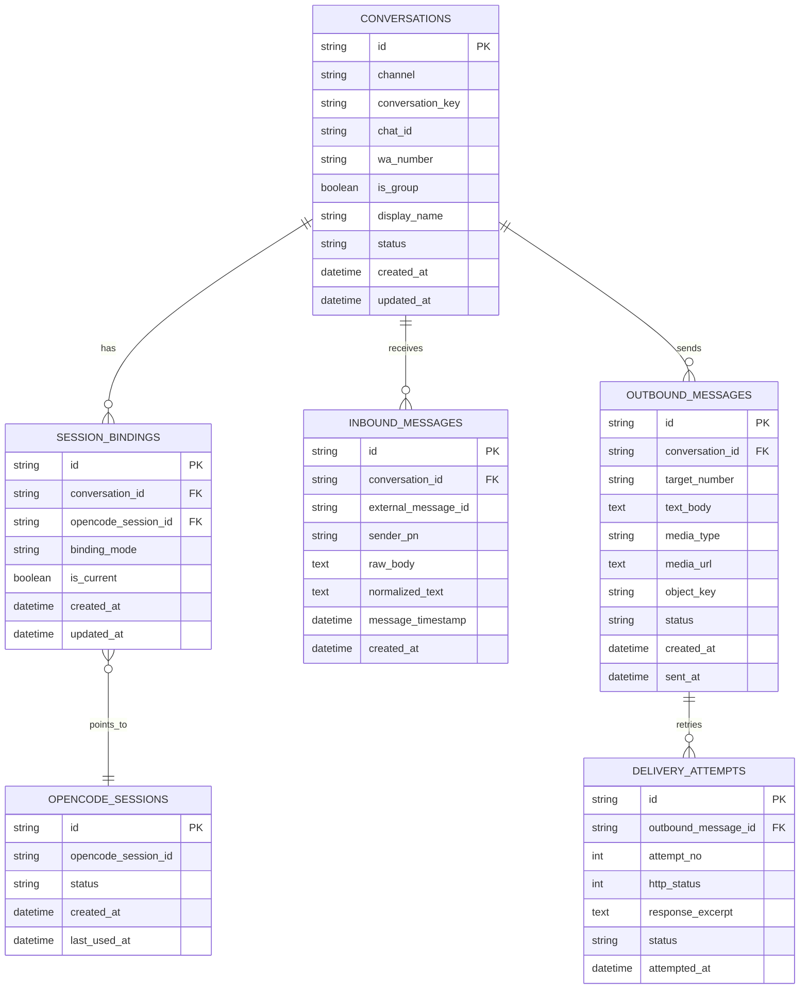
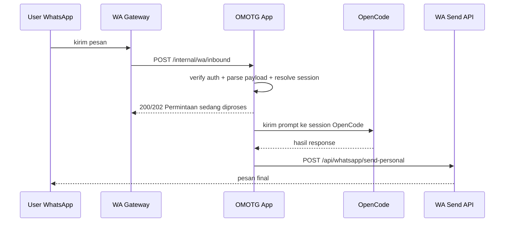
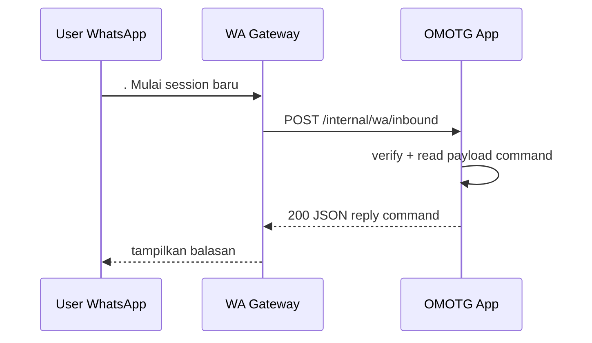
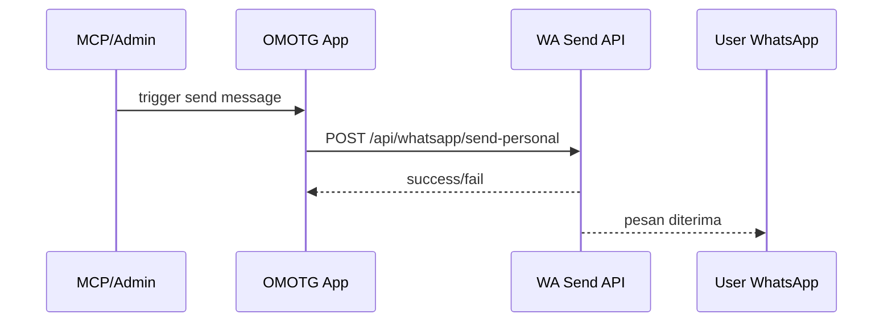

# PRD — OMOTG Refactor: WhatsApp ↔ OpenCode Bridge

## 1. Ringkas

Dokumen ini jadi sumber konteks utama untuk refactor `omotg` dari **Telegram ↔ OpenCode Bridge** menjadi **WhatsApp ↔ OpenCode Bridge** tanpa menghilangkan kemampuan inti:

- terima pesan user dari channel chat
- route pesan ke OpenCode
- kelola session per user/chat
- kirim balasan ke channel chat
- expose tool outbound lewat MCP/server internal

Dokumen ini sengaja ditulis sebagai pegangan engineering jangka lanjut supaya pekerjaan bisa dilanjutkan kapan pun tanpa hilang konteks.

---

## 2. Latar Belakang

### 2.1 Kondisi Saat Ini

Repo saat ini dibangun khusus untuk Telegram:

- inbound via Telegram webhook `POST /webhook`
- outbound via Telegram Bot API `sendMessage`
- support Telegram group/forum topic
- register webhook Telegram saat startup
- expose MCP tools untuk kirim pesan Telegram

### 2.2 Kebutuhan Baru

Target baru:

- ganti channel utama dari **Telegram** ke **WhatsApp**
- integrasi dengan **WhatsApp app/gateway yang sudah ada**
- tetap pakai OpenCode sebagai backend AI/session
- tetap punya kemampuan outbound manual/notifikasi
- desain harus tahan untuk pengembangan bertahap

### 2.3 Constraint Penting

- app WhatsApp existing sudah punya endpoint outbound:
  - `POST /api/whatsapp/send-personal`
- gateway/app existing juga bisa kirim inbound webhook ke app ini
- gateway mengharapkan response JSON dengan field reply tertentu
- gateway punya timeout sekitar `15000ms`
- repo existing berbasis Go stdlib only
- user punya opsi database: **MySQL**, **PostgreSQL**, dan **S3 bucket/object storage**

---

## 3. Problem Statement

Implementasi saat ini terlalu Telegram-specific. Jika dipaksa ganti langsung, akan banyak coupling di:

- payload parsing
- sender API
- webhook auth
- chat/thread/topic model
- command UX
- MCP tools naming

Tanpa desain refactor yang jelas, risiko:

- logic inti tercampur dengan adapter channel
- perubahan susah dipelihara
- future channel lain sulit ditambah
- session dan observability sulit dikembangkan
- timeout gateway WA memicu UX buruk

---

## 4. Product Vision

Membangun **channel-agnostic bridge** untuk OpenCode dengan adapter pertama: **WhatsApp**, sehingga sistem dapat:

- menerima pesan dari WhatsApp gateway
- mengirim prompt ke OpenCode
- menjaga konteks session user/chat
- mengembalikan balasan sinkron atau asinkron
- mengirim pesan manual/notifikasi ke WhatsApp
- siap berkembang ke persistence database dan monitoring lebih matang

---

## 5. Tujuan Produk

### 5.1 Goals

1. Mendukung inbound WhatsApp dari gateway existing.
2. Mendukung outbound WhatsApp ke endpoint existing `send-personal`.
3. Mempertahankan logic OpenCode session management.
4. Memisahkan domain logic dari adapter channel.
5. Menyediakan landasan untuk persistence ke database.
6. Mengurangi risiko timeout dengan strategi sync + async response.
7. Menjaga backward clarity untuk engineering berikutnya.

### 5.2 Non-Goals

1. Tidak wajib mempertahankan fitur Telegram forum topics.
2. Tidak wajib multi-channel penuh di fase pertama.
3. Tidak wajib media receive dari WhatsApp di fase pertama.
4. Tidak wajib dashboard admin di fase pertama.
5. Tidak wajib worker queue terpisah di fase pertama.

---

## 6. Pengguna dan Use Cases

### 6.1 Aktor

1. **End user WhatsApp**
   - kirim pesan ke bot/service
   - menerima balasan AI/system

2. **Admin/Operator**
   - kirim pesan manual/notifikasi ke nomor tertentu
   - pantau behavior layanan

3. **OpenCode / MCP client**
   - trigger pengiriman pesan keluar
   - menggunakan bridge sebagai tool komunikasi

4. **WhatsApp Gateway Existing**
   - mengirim inbound webhook
   - membaca response sinkron

### 6.2 Use Cases Utama

1. User chat personal ke WhatsApp bot → sistem balas.
2. Gateway kirim `command` yang sudah dibersihkan, mis. `Mulai session baru` → sistem handle.
3. User kirim pertanyaan bebas → diteruskan ke OpenCode.
4. Admin kirim pesan manual ke nomor tertentu.
5. Sistem kirim notifikasi async setelah proses panjang selesai.
6. Sistem simpan riwayat session dan mapping chat bila persistence diaktifkan.

Catatan:
- Prefix pesan asli WhatsApp boleh tetap ada di `rawMessage`, tetapi app ini tidak perlu bergantung pada prefix itu bila field `command` sudah tersedia dan bersih.

---

## 7. Requirement Fungsional

### 7.1 Inbound WhatsApp

Sistem harus menyediakan endpoint baru:

- `POST /internal/wa/inbound`

Request source mengikuti gateway existing. Minimal field yang harus didukung:

- `source`
- `service`
- `command`
- `rawMessage`
- `user.waNumber`
- `user.senderPn`
- `user.name`
- `user.chatId`
- `user.isGroup`
- `message.id`
- `message.timestamp`
- `message.body`
- `context.remoteJid`

### 7.2 Auth Inbound

Endpoint inbound harus memverifikasi minimal salah satu atau kedua mekanisme berikut:

- `Authorization: Bearer <secret>`
- `x-service-secret: <secret>`

Secret harus dikonfigurasi via env, tidak hardcoded.

### 7.3 Command Handling

Sistem harus membaca **field `command` dari payload inbound** sebagai sumber utama intent/aksi.

Artinya:

- sistem **tidak perlu bergantung pada prefix raw WhatsApp message** seperti `.` atau `/`
- field `rawMessage` tetap disimpan untuk audit/debug/context
- keputusan routing command harus berdasarkan nilai `command` yang sudah dibersihkan oleh gateway upstream

Contoh:

- `command: "Mulai session baru"`
- `rawMessage: ". Mulai session baru"`

Pada kasus di atas, app ini cukup membaca `command` saja.

Command yang harus didukung pada level intent minimal:

- `help`
- `start`
- `status`
- `deploy <env>`
- `logs [N]`
- `session`
- `session new [text]`
- `session list`
- `session switch <id>`
- `session delete <id>`

Normalisasi command dari bahasa natural gateway boleh dilakukan di layer mapper/normalizer sebelum masuk router internal.

Jika `command` kosong, barulah sistem boleh fallback ke `message.body` atau `rawMessage` untuk diperlakukan sebagai prompt OpenCode biasa.

Pesan non-command dianggap prompt OpenCode.

### 7.4 Session Handling

Sistem harus bisa memetakan session berdasarkan mode chat.

Default fase 1:

- private chat → 1 current session per `waNumber`
- group chat → 1 current session per `chatId`

Optional fase lanjut:

- mode group per participant: `chatId + participant`

### 7.5 Balasan Sinkron

Untuk command ringan atau proses cepat, endpoint inbound boleh mengembalikan response JSON yang langsung dibaca gateway.

Response kompatibel:

```json
{
  "success": true,
  "message": "OK",
  "data": {
    "reply": {
      "message": "OK"
    },
    "whatsappReply": {
      "message": "OK"
    }
  }
}
```

### 7.6 Balasan Asinkron

Untuk prompt OpenCode yang berpotensi >15 detik:

- endpoint inbound boleh cepat merespons status diproses
- proses OpenCode lanjut di background
- hasil final dikirim ke endpoint outbound WA

### 7.7 Outbound WhatsApp

Sistem harus memiliki client outbound ke:

- `POST /api/whatsapp/send-personal`

Auth:

- `Authorization: Bearer <WHATSAPP_API_TOKEN>`
- fallback sesuai konfigurasi bila diperlukan

Minimal payload text:

```json
{
  "nomor": "6281234567890",
  "pesan": "Halo"
}
```

Kompatibilitas lama tetap dapat dipertahankan pada layer client:

- `number`
- `message`
- `media`
- `lampiran`

### 7.8 Manual Send / MCP

Sistem harus tetap punya kemampuan tool/server internal untuk:

- kirim text ke nomor WA
- kirim notification ke nomor WA
- opsional kirim media jika fase berikutnya diaktifkan

### 7.9 Observability

Minimal logging:

- request inbound diterima
- auth success/fail
- session resolved/created
- OpenCode request start/finish
- outbound send success/fail
- timeout / fallback async

### 7.10 Error Handling

Jika inbound gagal:

- return HTTP status tepat (`401`, `400`, `500`)
- jangan bocorkan token/secret
- log error dengan context aman

---

## 8. Requirement Non-Fungsional

1. **Maintainability** — domain logic terpisah dari adapter WA.
2. **Security** — secret dan token via env/config saja.
3. **Performance** — inbound route ringan, tidak block terlalu lama tanpa alasan.
4. **Reliability** — support retry/fallback untuk outbound dan async flow.
5. **Extensibility** — siap ditambah persistence dan channel lain.
6. **Portability** — tetap bisa jalan di server Linux biasa.
7. **Minimal dependency bias** — boleh pertahankan stdlib-only di fase awal bila tidak menghambat.

---

## 9. Keputusan Arsitektur Utama

## 9.1 Pilihan Integrasi

Pilih **hybrid integration model**:

### Inbound
- WhatsApp gateway existing mengirim webhook ke app ini:
  - `POST /internal/wa/inbound`

### Outbound
- app ini mengirim pesan lewat app WhatsApp existing:
  - `POST /api/whatsapp/send-personal`

### Reply Strategy
- **Command cepat** → reply sinkron via HTTP response inbound
- **Prompt AI / proses lama** → response cepat “sedang diproses”, hasil final dikirim async via outbound endpoint

Ini dipilih karena:

- cocok dengan timeout gateway `15000ms`
- paling aman untuk workload AI
- tetap bisa beri UX cepat untuk command lokal
- tetap dukung kirim manual/notifikasi

---

## 10. Current State vs Target State

| Area | Current | Target |
|------|---------|--------|
| Channel | Telegram | WhatsApp gateway existing |
| Inbound | `POST /webhook` Telegram | `POST /internal/wa/inbound` |
| Outbound | Telegram `sendMessage` | WA `send-personal` |
| Topics | Telegram forum topics | dropped / not supported phase 1 |
| Session key | chat + topic | waNumber / chatId |
| Webhook registration | Telegram `setWebhook` on startup | none / external gateway managed |
| MCP tools | Telegram-specific | WhatsApp-specific |
| Reply mode | mostly direct to Telegram | sync for local commands, async for AI |
| Persistence | in-memory | in-memory first, DB-ready |

---

## 11. Domain Model

## 11.1 Core Entities

1. **ChannelMessage**
   - pesan masuk dari channel
2. **Conversation**
   - representasi chat pribadi atau group
3. **SessionBinding**
   - hubungan conversation → OpenCode session aktif
4. **OpenCodeSession**
   - session id dari OpenCode
5. **OutboundMessage**
   - pesan yang dikirim ke WA gateway
6. **CommandExecution**
   - command lokal yang diproses app
7. **DeliveryAttempt**
   - attempt kirim outbound

## 11.2 Logical Fields

### Conversation
- `channel` = `whatsapp`
- `conversation_key`
- `chat_id`
- `wa_number`
- `is_group`
- `display_name`
- `status`

### SessionBinding
- `conversation_key`
- `current_session_id`
- `mode`
- `last_used_at`

### OutboundMessage
- `conversation_key`
- `target_number`
- `text`
- `media_type`
- `media_url`
- `media_base64_ref`
- `status`
- `sent_at`

---

## 12. ERD Awal



Catatan:
- ERD ini untuk mode persistent.
- fase awal bisa tetap in-memory tanpa DB.

---

## 13. Data Flow dan Sequence

## 13.1 Inbound Prompt Async



## 13.2 Inbound Command Sync



## 13.3 Manual Outbound



---

## 14. API Contract Awal

## 14.1 Inbound Endpoint

### Request

`POST /internal/wa/inbound`

Headers:

```http
Authorization: Bearer <OMOTG_WA_INBOUND_SECRET>
x-service-secret: <OMOTG_WA_INBOUND_SECRET>
Content-Type: application/json
```

Body contoh:

```json
{
  "source": "whatsapp",
  "service": "task",
  "command": "Mulai session baru",
  "rawMessage": ". Mulai session baru",
  "user": {
    "waNumber": "6282177177767",
    "senderPn": "6282177177767@s.whatsapp.net",
    "name": "Bayu",
    "chatId": "51153194758269@lid",
    "isGroup": false,
    "participant": "6282177177767@s.whatsapp.net"
  },
  "message": {
    "id": "wa-message-id",
    "timestamp": "2026-05-17T00:00:00.000Z",
    "body": ".t tambah bayar listrik besok jam 8 malam",
    "senderPn": "6282177177767@s.whatsapp.net"
  },
  "context": {
    "groupId": null,
    "remoteJid": "51153194758269@lid",
    "pushName": "Bayu",
    "senderPn": "6282177177767@s.whatsapp.net",
    "senderIsAdmin": false
  }
}
```

### Response sync command

```json
{
  "success": true,
  "message": "Daftar command tersedia...",
  "data": {
    "reply": {
      "message": "Daftar command tersedia..."
    },
    "whatsappReply": {
      "message": "Daftar command tersedia..."
    }
  }
}
```

### Response async prompt

```json
{
  "success": true,
  "message": "Permintaan sedang diproses...",
  "data": {
    "reply": {
      "message": "Permintaan sedang diproses..."
    },
    "whatsappReply": {
      "message": "Permintaan sedang diproses..."
    },
    "async": true
  }
}
```

## 14.2 Outbound Send Endpoint (existing system)

Target endpoint external:

`POST {WHATSAPP_BASE_URL}/api/whatsapp/send-personal`

### Payload text

```json
{
  "nomor": "6281234567890",
  "pesan": "Halo, ini pesan dari bridge"
}
```

### Payload media image URL

```json
{
  "nomor": "6281234567890",
  "pesan": "Promo minggu ini",
  "media": {
    "type": "image",
    "url": "https://domain.com/files/promo.jpg",
    "caption": "Promo minggu ini"
  }
}
```

### Payload image base64

```json
{
  "nomor": "6281234567890",
  "pesan": "Ini gambar promo",
  "lampiran": "iVBORw0KGgoAAAANSUhEUgAA..."
}
```

---

## 15. Skema Normalisasi Payload Internal

Sistem perlu menormalisasi payload inbound WA ke model internal agar domain logic tidak tergantung bentuk webhook vendor.

Contoh normalized struct konseptual:

```go
type IncomingMessage struct {
    Channel        string
    ConversationKey string
    ChatID         string
    SenderNumber   string
    SenderPn       string
    SenderName     string
    IsGroup        bool
    Participant    string
    MessageID      string
    MessageText    string
    RawMessage     string
    Timestamp      time.Time
}
```

Aturan `ConversationKey` fase 1:

- private: `wa:{waNumber}`
- group: `wa-group:{chatId}`

Optional mode lanjutan:

- group per user: `wa-group:{chatId}:{participant}`

---

## 16. Komponen Teknis Target

## 16.1 Layer yang Disarankan

1. **transport/http**
   - inbound handlers
   - response writers
   - auth header verification

2. **channel/whatsapp**
   - payload parser
   - outbound sender client
   - formatting rules

3. **core/bridge**
   - command processing
   - session resolving
   - async orchestration
   - OpenCode bridge logic

4. **storage**
   - in-memory store
   - optional SQL store
   - optional object storage adapter

5. **mcp**
   - outbound tools for WA

### 16.2 Target Package Direction

Contoh target package logical map:

```text
omotg/
├── main.go
├── config.go
├── bridge/
│   ├── service.go
│   ├── commands.go
│   ├── session_resolver.go
│   └── models.go
├── channel/
│   └── whatsapp/
│       ├── inbound.go
│       ├── outbound.go
│       ├── auth.go
│       └── mapper.go
├── storage/
│   ├── memory.go
│   ├── postgres.go
│   ├── mysql.go
│   └── objectstore.go
├── opencode/
│   └── client.go
└── mcp/
    └── ...
```

Catatan:
- ini arah target, bukan kewajiban fase pertama.
- fase 1 boleh tetap minim perubahan file bila cepat, tapi boundary harus mulai jelas.

---

## 17. Roadmap Engineering

## Phase 0 — Dokumentasi dan keputusan desain

Output:
- PRD ini selesai
- arsitektur target jelas
- keputusan sync vs async jelas
- data model dan opsi persistence terdokumentasi

Status:
- current phase

## Phase 1 — Minimal WhatsApp MVP tanpa DB

Target:
- inbound endpoint `/internal/wa/inbound`
- outbound client `send-personal`
- auth inbound secret
- reader/normalizer `command` dari payload gateway
- mapping intent command ke router internal
- OpenCode bridge tetap jalan
- reply sync untuk command lokal
- async reply untuk prompt OpenCode
- logging dasar

Storage:
- masih in-memory

Keberhasilan:
- user bisa chat WA dan dapat balasan
- admin/MCP bisa kirim pesan keluar

## Phase 2 — Refactor boundary dan cleanup Telegram coupling

Target:
- pisahkan adapter WA dari core bridge
- hilangkan ketergantungan Telegram-specific di path utama
- rename MCP tools jadi channel-appropriate
- rapikan config/env
- update README

Keberhasilan:
- codebase lebih bersih dan maintainable

## Phase 3 — Persistence database

Target:
- simpan conversation
- simpan session binding
- simpan inbound/outbound logs
- simpan delivery attempts
- optional idempotency by message id

Pilihan DB:
- PostgreSQL preferred
- MySQL optional

Keberhasilan:
- restart service tidak hilangkan context mapping internal
- bisa audit basic traffic

## Phase 4 — Media dan object storage

Target:
- support lampiran/media outbound lebih baik
- support simpan payload besar/media metadata ke object storage
- simpan reference ke DB

Pilihan storage object:
- S3 bucket compatible

## Phase 5 — Reliability dan operasional

Target:
- retry outbound
- dead-letter/failure log
- worker queue optional
- metrics and tracing optional
- admin control endpoint optional

---

## 18. PRD Implementasi Fase 1

## 18.1 Scope Fase 1

Wajib:
- terima webhook inbound WA
- verifikasi secret
- baca field `command` payload inbound
- support command dasar berbasis nilai `command`
- route free text ke OpenCode
- balas async bila perlu
- kirim outbound ke send-personal

Tidak wajib:
- DB
- dashboard
- media inbound
- scheduling
- worker queue terpisah
- Telegram compatibility mode

## 18.2 Success Metrics Fase 1

1. 95% request command lokal selesai < 2 detik.
2. 95% request outbound text sukses pada koneksi normal.
3. Prompt panjang tidak gagal total hanya karena timeout 15 detik gateway.
4. Restart service tidak corrupt session store in-memory selama runtime aktif.
5. Log cukup untuk trace satu request end-to-end.

## 18.3 Acceptance Criteria Fase 1

### AC-1 Inbound auth
Given request tanpa secret valid  
When request masuk  
Then service return `401`

### AC-2 Help command
Given payload inbound berisi `command: "help"`  
When diproses  
Then service return `2xx` dengan message help yang bisa dibaca gateway

### AC-3 Free text prompt
Given request body teks biasa  
When diproses  
Then service segera return status diproses dan hasil final dikirim lewat outbound WA

### AC-4 Session reuse
Given user private yang sudah punya session aktif  
When kirim pesan kedua  
Then service memakai session OpenCode yang sama

### AC-5 Manual outbound
Given tool internal memanggil kirim pesan  
When payload valid  
Then service memanggil `/api/whatsapp/send-personal` dengan auth benar

---

## 19. Database Recommendation

## 19.1 Fase Awal

Gunakan **in-memory only** dulu untuk cepat validasi alur.

## 19.2 DB Pilihan Utama

**PostgreSQL** direkomendasikan sebagai persistence utama karena:

- kuat untuk relational modeling
- JSONB berguna untuk payload raw
- indexing baik
- cocok untuk audit/event log
- migration tooling ekosistem matang bila nanti dibutuhkan

## 19.3 MySQL

Bisa dipakai jika environment existing lebih dominan MySQL.

Cocok untuk:
- conversation
- session binding
- outbound logs

Kurang unggul dibanding PostgreSQL untuk payload semi-structured yang sering berubah.

## 19.4 S3 Bucket / Object Storage

Dipakai untuk:
- simpan media besar
- simpan payload mentah jika terlalu besar
- arsip log tertentu
- attachment base64 yang dinormalisasi jadi object file

Jangan pakai S3 bucket sebagai pengganti relational DB utama.

## 19.5 Rekomendasi Akhir

- **Primary relational DB:** PostgreSQL
- **Optional compatibility:** MySQL
- **Binary/blob/archive storage:** S3-compatible bucket

---

## 20. Schema Awal SQL Konseptual

## 20.1 PostgreSQL / MySQL compatible draft

```sql
CREATE TABLE conversations (
  id VARCHAR(64) PRIMARY KEY,
  channel VARCHAR(32) NOT NULL,
  conversation_key VARCHAR(255) NOT NULL UNIQUE,
  chat_id VARCHAR(255),
  wa_number VARCHAR(32),
  is_group BOOLEAN NOT NULL DEFAULT FALSE,
  display_name VARCHAR(255),
  status VARCHAR(32) NOT NULL DEFAULT 'active',
  created_at TIMESTAMP NOT NULL,
  updated_at TIMESTAMP NOT NULL
);

CREATE TABLE opencode_sessions (
  id VARCHAR(64) PRIMARY KEY,
  opencode_session_id VARCHAR(255) NOT NULL UNIQUE,
  status VARCHAR(32) NOT NULL DEFAULT 'active',
  created_at TIMESTAMP NOT NULL,
  last_used_at TIMESTAMP NOT NULL
);

CREATE TABLE session_bindings (
  id VARCHAR(64) PRIMARY KEY,
  conversation_id VARCHAR(64) NOT NULL,
  opencode_session_id VARCHAR(64) NOT NULL,
  binding_mode VARCHAR(32) NOT NULL DEFAULT 'current',
  is_current BOOLEAN NOT NULL DEFAULT TRUE,
  created_at TIMESTAMP NOT NULL,
  updated_at TIMESTAMP NOT NULL,
  CONSTRAINT fk_session_bindings_conversation
    FOREIGN KEY (conversation_id) REFERENCES conversations(id),
  CONSTRAINT fk_session_bindings_opencode
    FOREIGN KEY (opencode_session_id) REFERENCES opencode_sessions(id)
);

CREATE TABLE inbound_messages (
  id VARCHAR(64) PRIMARY KEY,
  conversation_id VARCHAR(64) NOT NULL,
  external_message_id VARCHAR(255),
  sender_pn VARCHAR(255),
  raw_body TEXT,
  normalized_text TEXT,
  message_timestamp TIMESTAMP NULL,
  created_at TIMESTAMP NOT NULL,
  CONSTRAINT fk_inbound_messages_conversation
    FOREIGN KEY (conversation_id) REFERENCES conversations(id)
);

CREATE TABLE outbound_messages (
  id VARCHAR(64) PRIMARY KEY,
  conversation_id VARCHAR(64) NOT NULL,
  target_number VARCHAR(32) NOT NULL,
  text_body TEXT,
  media_type VARCHAR(32),
  media_url TEXT,
  object_key VARCHAR(255),
  status VARCHAR(32) NOT NULL DEFAULT 'pending',
  created_at TIMESTAMP NOT NULL,
  sent_at TIMESTAMP NULL,
  CONSTRAINT fk_outbound_messages_conversation
    FOREIGN KEY (conversation_id) REFERENCES conversations(id)
);

CREATE TABLE delivery_attempts (
  id VARCHAR(64) PRIMARY KEY,
  outbound_message_id VARCHAR(64) NOT NULL,
  attempt_no INT NOT NULL,
  http_status INT,
  response_excerpt TEXT,
  status VARCHAR(32) NOT NULL,
  attempted_at TIMESTAMP NOT NULL,
  CONSTRAINT fk_delivery_attempts_outbound
    FOREIGN KEY (outbound_message_id) REFERENCES outbound_messages(id)
);
```

Indexes yang direkomendasikan:

```sql
CREATE INDEX idx_conversations_channel_key ON conversations(channel, conversation_key);
CREATE INDEX idx_inbound_external_message_id ON inbound_messages(external_message_id);
CREATE INDEX idx_outbound_target_number ON outbound_messages(target_number);
CREATE INDEX idx_session_bindings_current ON session_bindings(conversation_id, is_current);
```

---

## 21. ERP / Operational Flow Map

Jika dimaknai sebagai operational process map, alur ERP internal sederhana:

1. **Inbound Intake**
   - terima request gateway
   - validasi auth
   - validasi payload

2. **Conversation Resolution**
   - tentukan conversation key
   - lookup/create session binding

3. **Intent Routing**
   - command lokal atau prompt OpenCode

4. **Execution**
   - local command handler atau OpenCode call

5. **Response Dispatch**
   - sync JSON reply atau async outbound WA

6. **Logging/Persistence**
   - simpan inbound log
   - simpan outbound log
   - simpan delivery attempt

7. **Admin/MCP Trigger**
   - manual outbound
   - notification outbound

---

## 22. Security Considerations

1. Semua token/secret lewat env.
2. Jangan log token, secret, atau payload sensitif penuh.
3. Sanitasi text untuk log output.
4. Validasi `waNumber`/`chatId` minimal format dasar.
5. Batasi allowed senders jika dibutuhkan.
6. Jika expose endpoint public, wajib pakai HTTPS/reverse proxy aman.
7. Pertimbangkan idempotency memakai `message.id` agar pesan tidak diproses ganda.
8. Jangan hardcode fallback token jika tidak perlu.

---

## 23. Risks dan Mitigasi

| Risk | Dampak | Mitigasi |
|------|--------|----------|
| OpenCode lambat | gateway timeout, UX jelek | async reply model |
| Payload gateway berubah | parser rusak | normalizer layer terpisah |
| Session hilang saat restart | context putus | phase 3 persistence |
| Outbound WA gagal | user tak dapat hasil | retry + delivery log |
| Group semantics tidak jelas | context salah | definisikan mode group sejak awal |
| Nilai `command` dari gateway tidak konsisten | routing salah | normalizer + fallback ke prompt biasa |
| Coupling lama Telegram tertinggal | code bau | phase 2 cleanup |

---

## 24. Open Questions

1. Apakah group chat WA perlu satu session bersama atau per anggota?
2. Seberapa konsisten gateway akan mengirim nilai `command` yang sudah dinormalisasi?
3. Apakah outbound async wajib menyimpan retry queue, atau cukup best-effort dulu?
4. Apakah admin butuh endpoint HTTP manual send selain MCP tools?
5. Apakah inbound media dari WA akan masuk scope segera?
6. Apakah semua outbound harus melalui nomor personal endpoint, atau nanti ada endpoint group?

---

## 25. Rencana Refactor File Existing

| Existing File | Aksi | Catatan |
|---------------|------|---------|
| `main.go` | modify | ganti wiring Telegram ke WhatsApp inbound/outbound |
| `config.go` | modify | tambah env WA secrets/base URL/token |
| `bot/handler.go` | split/refactor | pecah logic domain vs transport |
| `bot/router.go` | modify | terima intent command hasil normalisasi gateway |
| `bot/session.go` | reuse | tetap berguna dengan mapping baru |
| `bot/opencode.go` | reuse | client OpenCode tetap relevan |
| `bot/telegram.go` | deprecate/remove | ganti dengan client WhatsApp |
| `mcp/tools.go` | modify | tool names dan sender jadi WA |
| `README.md` | update later | sesuaikan docs deploy/config |

---

## 26. Env Var Draft Baru

```env
# OpenCode
OPENCODE_SERVER_URL=http://127.0.0.1:4096
OPENCODE_SERVER_PASSWORD=change-me

# App HTTP
OMOTG_HTTP_PORT=8443
OMOTG_ALLOWED_CHAT_IDS=
OMOTG_SESSION_TIMEOUT=300

# WhatsApp inbound auth
OMOTG_WA_INBOUND_SECRET=change-me

# WhatsApp outbound
WHATSAPP_BASE_URL=http://127.0.0.1:8090
WHATSAPP_API_TOKEN=change-me
WHATSAPP_SEND_PATH=/api/whatsapp/send-personal

# Optional persistence
OMOTG_DB_DRIVER=
OMOTG_DB_DSN=
OMOTG_S3_ENDPOINT=
OMOTG_S3_BUCKET=
OMOTG_S3_ACCESS_KEY=
OMOTG_S3_SECRET_KEY=
OMOTG_S3_REGION=
```

Catatan:
- `OMOTG_ALLOWED_CHAT_IDS` nanti bisa diganti nama lebih netral, mis. `OMOTG_ALLOWED_IDENTIFIERS`.

---

## 27. Recommended Next Implementation Order

1. Buat config baru WA inbound/outbound.
2. Buat endpoint `POST /internal/wa/inbound`.
3. Buat parser payload WA → normalized struct.
4. Reuse command router + adaptasi input dari field `command`.
5. Reuse session map + mapping key baru.
6. Reuse OpenCode client.
7. Buat outbound WhatsApp client ke `send-personal`.
8. Tambah async flow untuk free text prompt.
9. Ubah MCP tools ke WhatsApp sender.
10. Bersihkan sisa coupling Telegram.
11. Tambah persistence bila flow sudah stabil.

---

## 28. Definition of Done

Refactor WhatsApp dianggap selesai untuk MVP bila:

- inbound WA dapat diterima dan diautentikasi
- command lokal jalan dari WhatsApp
- prompt OpenCode bisa diproses untuk private chat
- hasil final bisa dikirim ke nomor user via outbound endpoint existing
- log cukup untuk debug
- dokumentasi config dan flow sudah diperbarui
- tidak ada ketergantungan wajib pada Telegram untuk jalur utama runtime

---

## 29. Kesimpulan

Arah paling tepat untuk repo ini:

- jadikan `omotg` sebagai **bridge engine**
- gunakan **WhatsApp gateway existing** untuk inbound dan outbound
- pakai **hybrid sync + async response model**
- pertahankan session/OpenCode core
- tambah persistence secara bertahap, dengan **PostgreSQL** sebagai pilihan utama

Dokumen ini harus dipakai sebagai referensi utama saat mulai implementasi refactor berikutnya.
